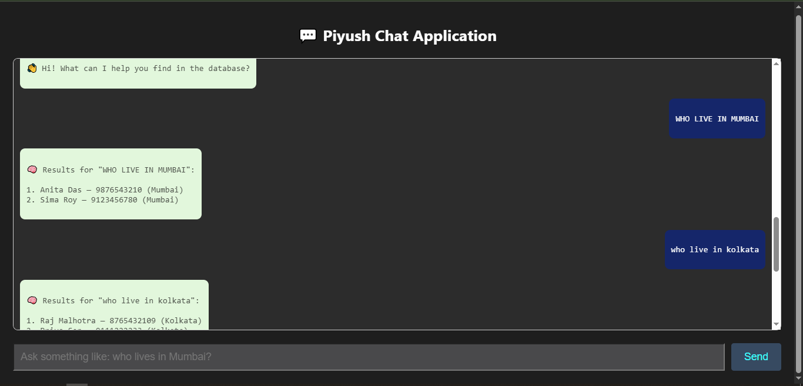
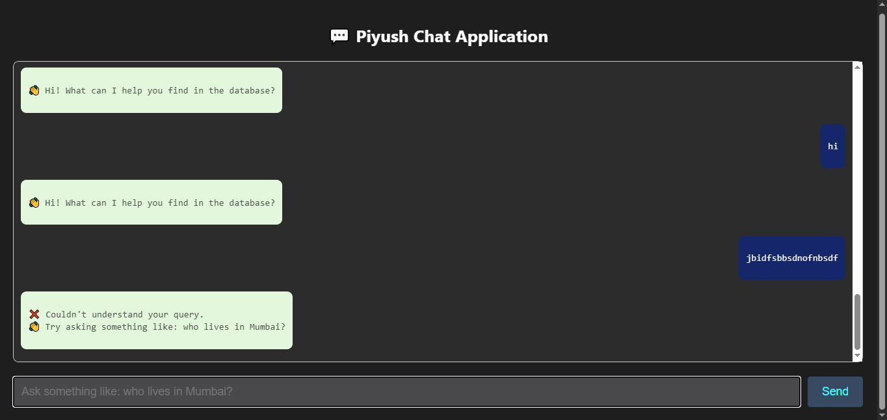

<div align="center"
  style="background: linear-gradient(to right, #667eea, #764ba2); padding: 30px; border-radius: 10px; color: white;">
  <h1 style="font-size: 2.5rem; margin-bottom: 10px;">🤖 LLM-Powered Chatbot</h1>
  <h3 style="font-weight: normal;">Spring Boot + React + MySQL + Groq LLMs</h3>
</div>

<hr>

<div align="center" style="margin-bottom: 20px;">
  <h2 style="color:#ff6f61;">🎥  Demo</h2>
  <video src="https://github.com/user-attachments/assets/509f6a45-1e3c-44e2-80b7-ce2170815bf1" controls width="600">
    Your browser does not support the video tag.
  </video>
</div>

<h2 style="color:#764ba2;">🛠️ How This Project Was Built</h2>

<ul>
  <li><span style="color:#333;"><strong>Frontend:</strong> React (HTML + CSS)</span></li>
  <li><span style="color:#333;"><strong>Backend:</strong> Spring Boot with REST endpoints</span></li>
  <li><span style="color:#333;"><strong>LLM:</strong> Groq-hosted LLaMA or Mistral for converting natural language to
      SQL</span></li>
  <li><span style="color:#333;"><strong>Database:</strong> MySQL with a <code>customer</code> table</span></li>
  <li><span style="color:#333;"><strong>Security:</strong> API Key stored securely in <code>application.properties</code></span></li>
</ul>

<hr>

<h2 style="color:#764ba2;">🚀 Getting Started</h2>

<ol>
  <li><b>Install React dependencies:</b><br><code>cd frontpart</code><br><code>npm install</code></li>
  <li><b>Run the React frontend:</b><br><code>npm start</code></li>
  <li><b>Return to backend project:</b><br><code>cd ..</code></li>
  <li><b>Create <code>application.properties</code> file:</b><br> Inside <code>src/main/resources/</code> directory:</li>
</ol>

```properties
server.port=8080
groq.api.key=your_groq_api_key_here
spring.datasource.url=jdbc:mysql://localhost:3306/your_db_name
spring.datasource.username=your_mysql_username
spring.datasource.password=your_mysql_<ol start="5"> <li><b>Run the Spring Boot application:</b><br>Use your IDE or run:<br><code>./mvnw spring-boot:run</code></li> </ol> <hr> <h2 style="color:#764ba2;">🌐 Access the App</h2> <ul> <li><b>Frontend:</b> <a href="http://localhost:3000" target="_blank">http://localhost:3000</a></li> <li><b>Backend API:</b> <code>POST http://localhost:8080/query</code></li> </ul> <hr> <h2 style="color:#764ba2;">🧪 Try These Sample Questions</h2> <ul> <li>Who lives in Mumbai?</li> <li>Show all customers</li> <li>Get names and phone numbers from Delhi</li> <li>List all female customers</li> </ul> <hr> <h2 style="color:#764ba2;">📦 Tech Stack Used</h2> <table style="width:100%; border:1px solid #ddd;"> <tr style="background:#f6f6f6;"> <th align="left">Layer</th> <th align="left">Technology</th> </tr> <tr> <td>💡 LLM</td> <td>Groq-hosted LLaMA or Mistral</td> </tr> <tr> <td>🎨 Frontend</td> <td>HTML, CSS, ReactJS</td> </tr> <tr> <td>🧠 Backend</td> <td>Java, Spring Boot</td> </tr> <tr> <td>🗄️ Database</td> <td>MySQL</td> </tr> <tr> <td>🔐 Secrets</td> <td>application.properties</td> </tr> </table> <hr> <h2 style="color:#764ba2;">🔐 Security Notes</h2> <ul> <li>✅ API key is hidden using <code>application.properties</code></li> <li>✅ <code>application.properties</code> is ignored by <code>.gitignore</code></li> <li>✅ Only SELECT queries allowed from the LLM</li> </ul> <hr> <h2 style="color:#764ba2; text-align:center;">📸 Screenshots</h2> <div style="text-align:center;"> <h3 style="color:#4caf50;">✅ Successfully Executed Query</h3>  <p style="color:#555; font-size:16px;">The chatbot successfully converted a natural language query into SQL and displayed the result from the database.</p> </div> <br /> <div style="text-align:center;"> <h3 style="color:#f44336;">❌ Unrecognized Query</h3>  <p style="color:#555; font-size:16px;">When the chatbot cannot interpret the natural language input, it responds with a fallback message prompting for a clearer query.</p> </div> <hr> <h2 style="color:#764ba2;">📌 Future Enhancements</h2> <ul> <li>🔐 Add authentication system</li> <li>📡 Deploy backend to cloud (Render/Railway)</li> <li>🗃️ Add support for more tables and databases</li> <li>📤 Add file upload to import customer data</li> </ul> <hr> <h2 style="color:#764ba2;">🤝 Contributing</h2> <p>If you like this project, feel free to fork it and raise PRs for suggestions!</p> password
